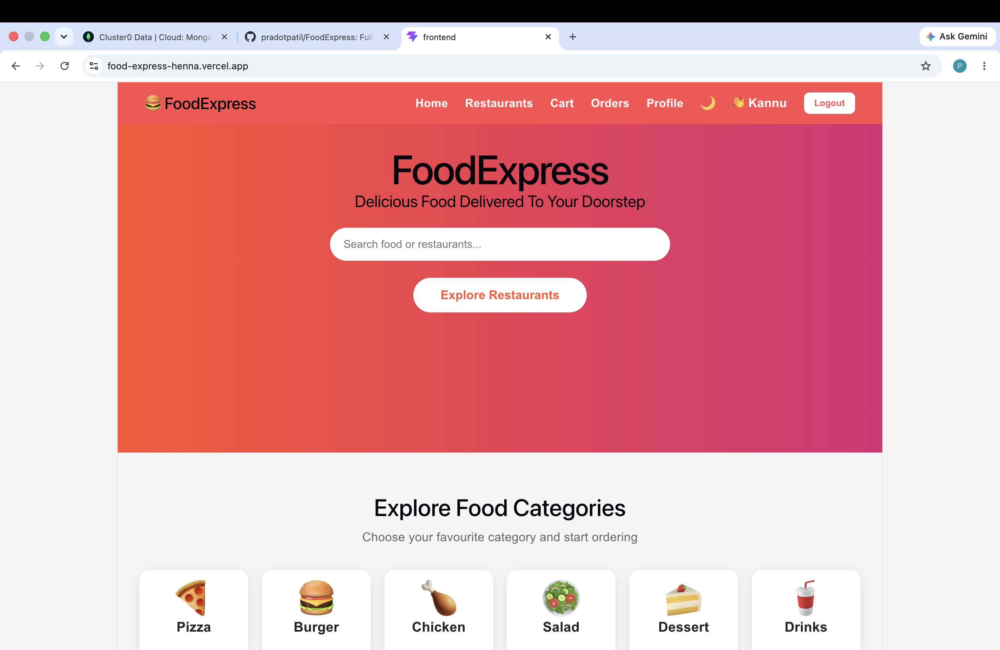
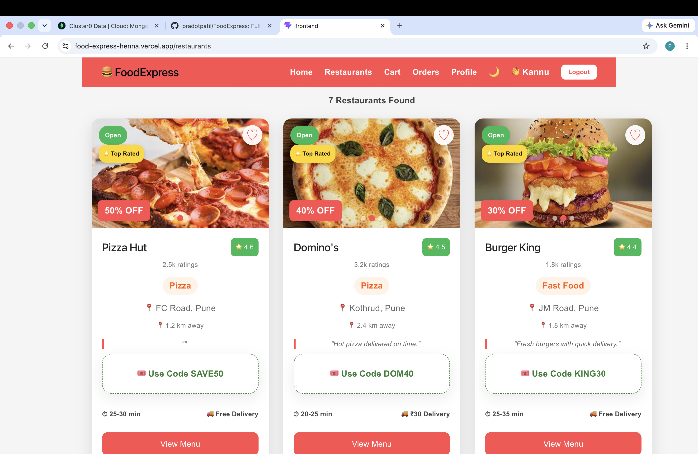
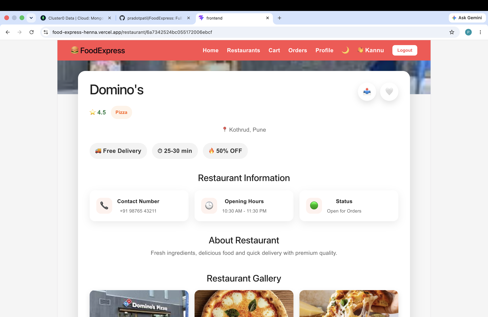
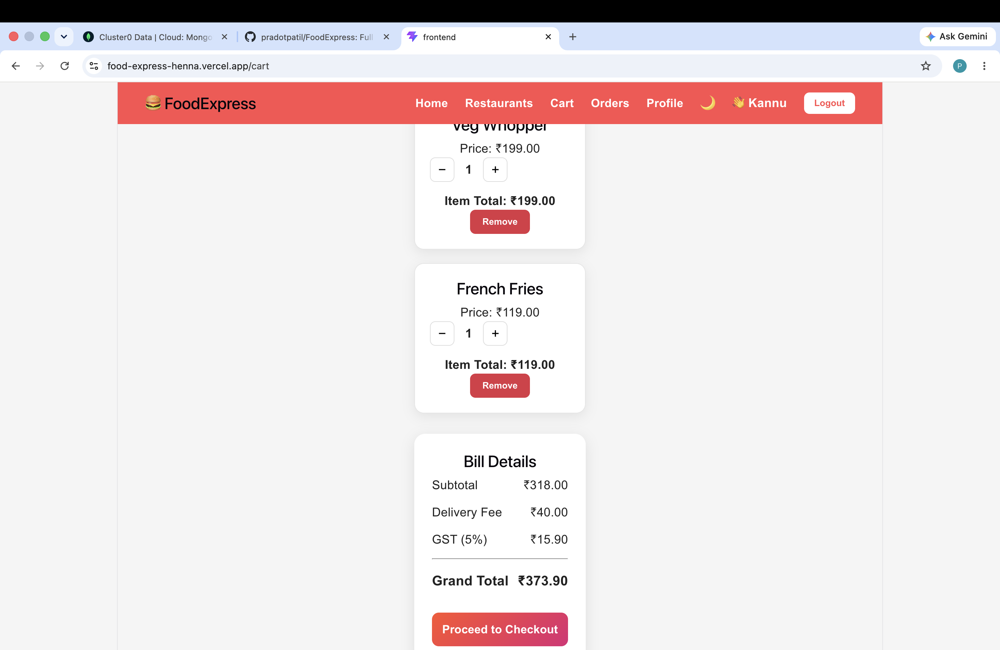
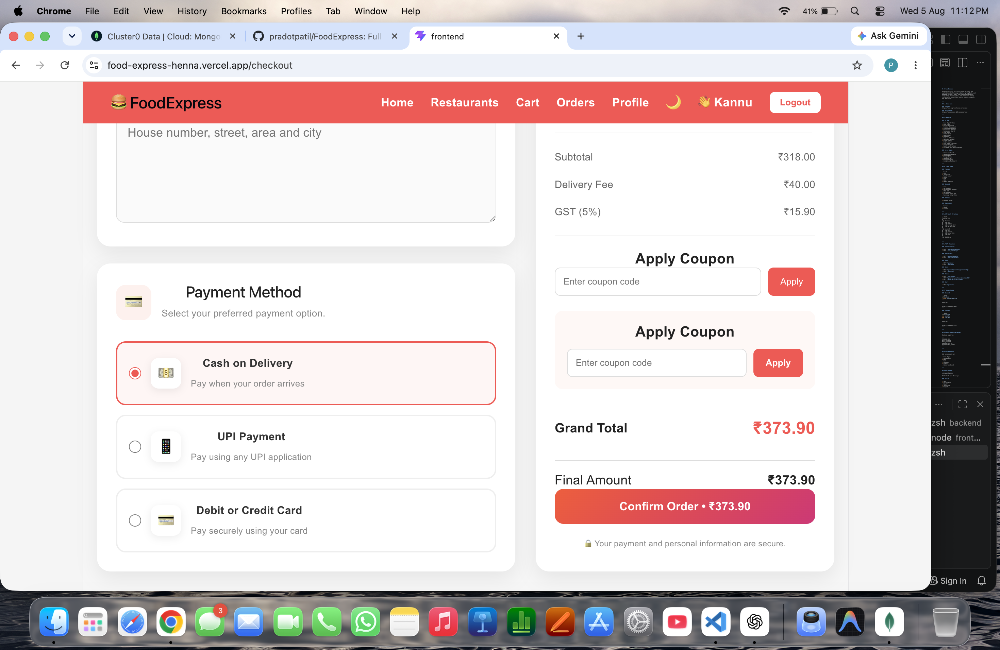
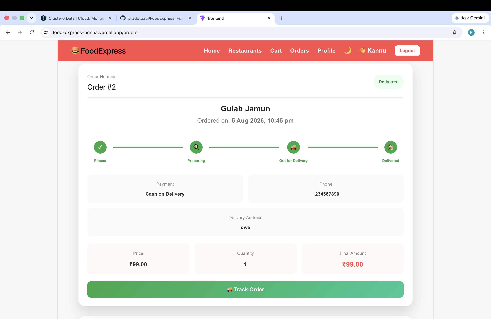
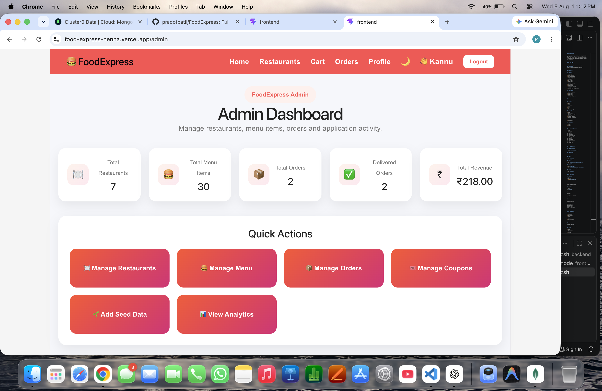
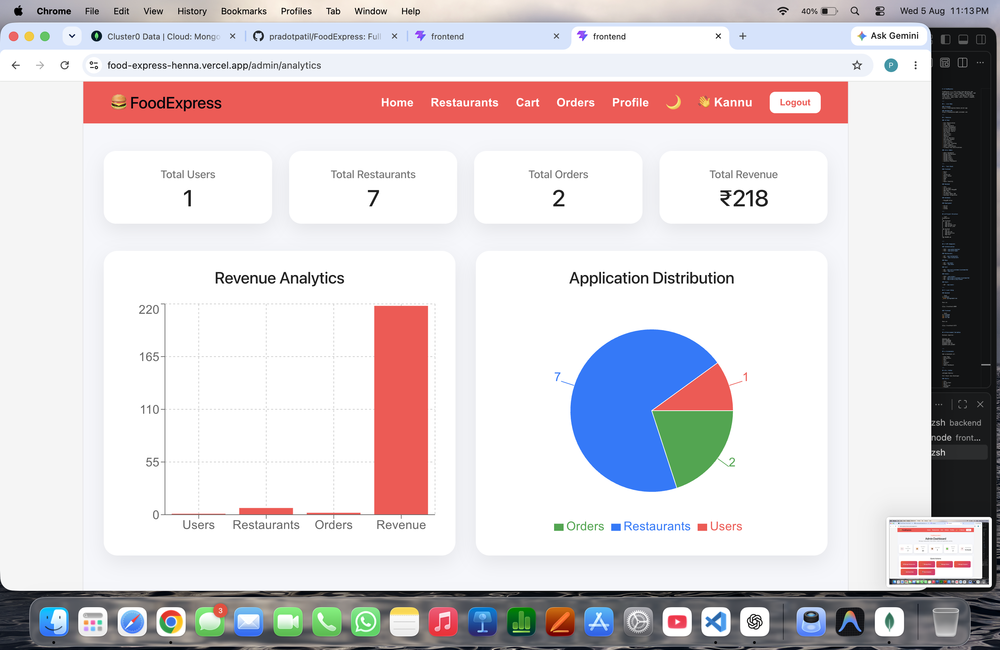

# 🍔 FoodExpress

FoodExpress is a full-stack food delivery web application built using **React, Spring Boot, and MongoDB Atlas**. Users can browse restaurants, order food, track orders, and admins can manage restaurants, menu items, users, orders, coupons, and analytics.

---

## 🚀 Live Demo

### Frontend
https://food-express-henna.vercel.app

### Backend API
https://foodexpress-qb0c.onrender.com

---

## ✨ Features

### 👤 User

- User Registration
- User Login
- Forgot Password
- Profile Management
- Browse Restaurants
- Restaurant Details
- Restaurant Search
- View Menu
- Add to Cart
- Update Cart
- Checkout
- Cash on Delivery
- Razorpay Payment
- Place Orders
- Order History
- Live Order Tracking
- Coupon Support
- Email Confirmation
- Firebase Push Notifications

### 👨‍💼 Admin

- Admin Dashboard
- Manage Restaurants
- Manage Menu
- Manage Users
- Manage Orders
- Manage Coupons
- Analytics Dashboard

---

## 🛠 Tech Stack

### Frontend

- React
- Vite
- JavaScript
- React Router
- Axios
- HTML
- CSS
- React Toastify

### Backend

- Java
- Spring Boot
- Spring Data MongoDB
- REST API
- Spring Mail
- Firebase Admin SDK
- Razorpay Integration

### Database

- MongoDB Atlas

### Deployment

- Vercel
- Render
- GitHub

---

## 📂 Project Structure

```text
FoodExpress
│
├── frontend
│   ├── src
│   ├── public
│   ├── package.json
│   └── vercel.json
│
├── backend
│   ├── src
│   ├── pom.xml
│   ├── Dockerfile
│   └── mvnw
│
└── README.md
```

---

## 🔗 API Endpoints

### Authentication

- POST `/api/auth/register`
- POST `/api/auth/login`

### Restaurants

- GET `/api/restaurants`
- POST `/api/restaurants`

### Menu

- GET `/api/menu`
- POST `/api/menu`

### Cart

- GET `/api/cart/customer/{customerId}`
- POST `/api/cart`

### Orders

- POST `/api/orders`
- GET `/api/orders/customer/{customerId}`
- PUT `/api/orders/{id}/status`

### Users

- GET `/api/users`

---

## ⚙️ Local Setup

### Backend

```bash
cd backend
./mvnw spring-boot:run
```

Runs on:

```
http://localhost:8080
```

### Frontend

```bash
cd frontend
npm install
npm run dev
```

Runs on:

```
http://localhost:5173
```

---

## 🔐 Environment Variables

Backend requires:

```
MONGODB_URI
MAIL_USERNAME
MAIL_PASSWORD
RAZORPAY_KEY_ID
RAZORPAY_KEY_SECRET
```

---

## 📸 Screenshots

Add screenshots of:

- Home Page
- Restaurants
- Menu
- Cart
- Checkout
- Orders
- Admin Dashboard

---

## 👨‍💻 Author

**Pradot Patil**

Full Stack Java Developer

### Skills

- Java
- Spring Boot
- React
- JavaScript
- MongoDB
- MySQL
- HTML
- CSS
- Bootstrap
- REST APIs

## 📸 Project Screenshots

### Home Page


### Restaurants


### Restaurants1

### Menu


### Cart


### Checkout


### Orders


### Admin Dashboard


### Analytics

